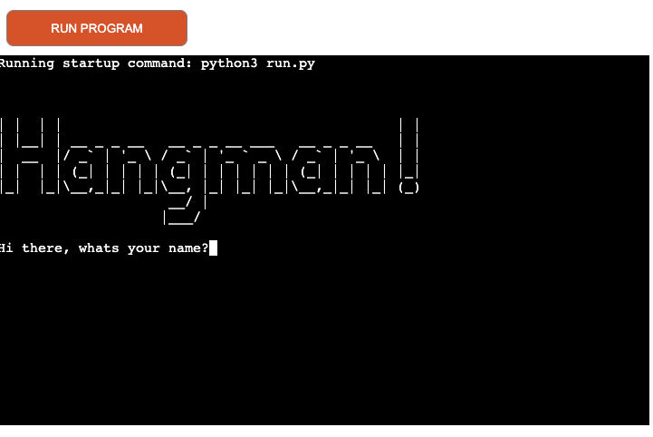
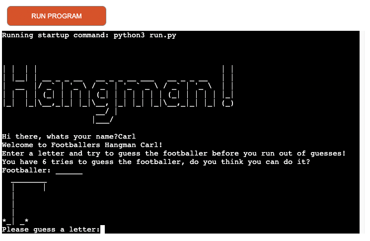
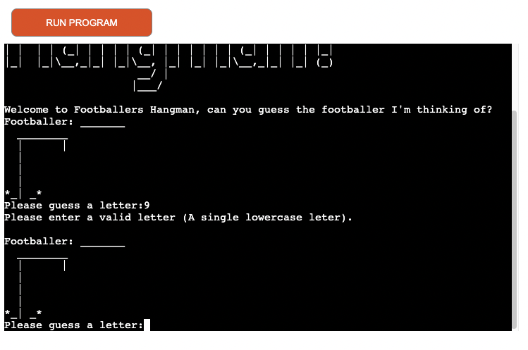
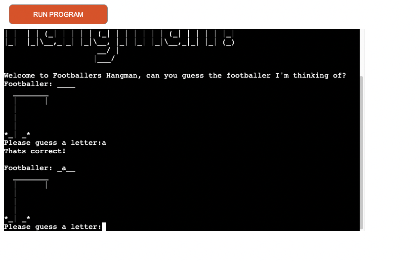
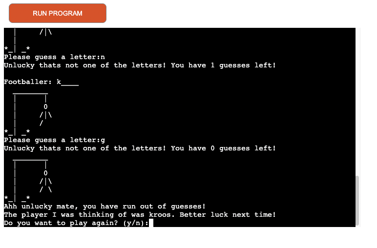
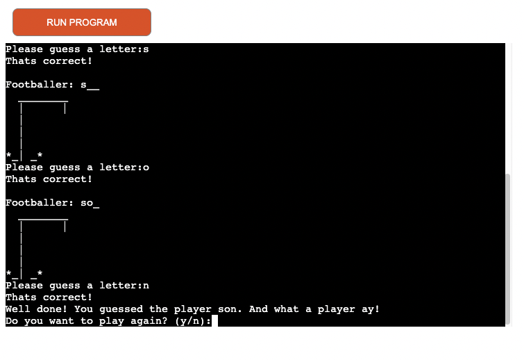
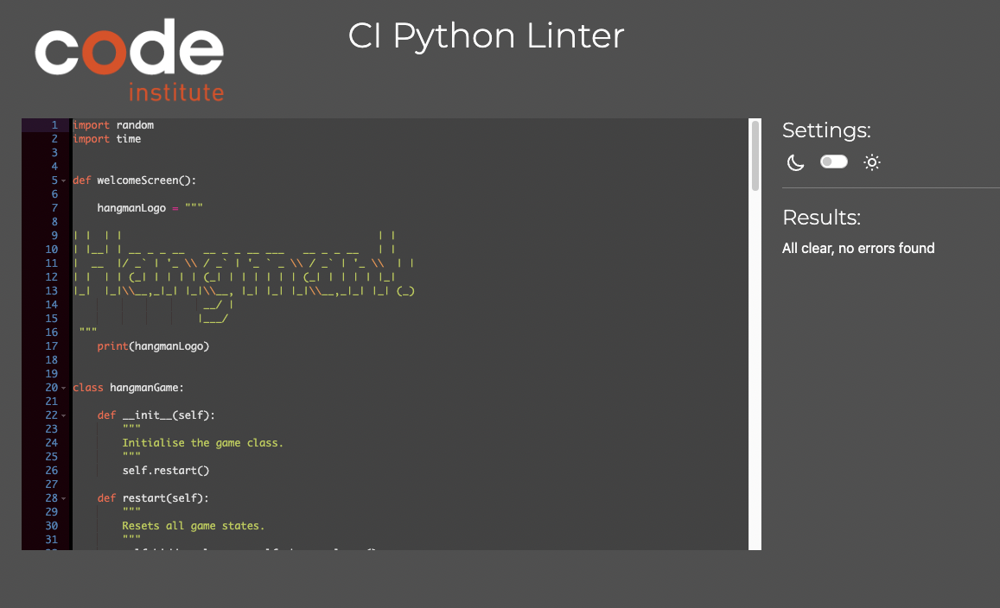

# Footballers Hangman

Welcome to Footballers Hangman!

 

Footballers Hangman is a Python terminal game which runs through Heroku and is based on the classic game, Hangman.

Will you succeed in guessing before your guesses run out or will you be dangling from above?

## How to play:

Here your knowledge will be tested on famous footballers.

A random footballer will be generated for you to guess. As with the classic hangman game, you will have oppotunites to guess letters in which to guess the correct footballer. If you guess the correct letter the blank will be filled in, however get it worng and you will be one step closer to being hanged.

# Table of contents

- [1. Live Game](#1-live-game)
- [2. Goals](#2-goals)
- [3. Features](#3-features)
- [4. Technologies Used](#4-technologies-used)
- [5. Testing](#5-testing)
- [6. Deployment](#6-deployment)
- [7. Acknowledgements and Credits](#7-acknowledgements-and-credits)

 

## 1. Live Game:
Please see the live site here: [Footballers Hangman](https://footballers-hangman-cf411def0ec1.herokuapp.com/)

## 2. Goals:

### Developer Goals:

- I would like the game to be fun but testing.
- I wanted the game to be easy to use and navigate through.

### User stories /Goals:

- As a user, I would like to be able to play the game in the command line.
- As a user, I would like to see when I guess correctly.
- As a user, I would like to see how many guesses I have left if I guess wrong.
- As a user, I would like to see the answer if I run out of guesses.
- As a user, I would like to be asked to play again at the end of the game.

 

## 3. Features:

### The Welcome Screen:

- When you run the game you will have a welcome screen loaded which then asks you for your name.

### Rules:

- The game will then feel personalised to you and you will be told the rules on how to play.

### Random Footballer

- The game will choose a random footballer for you to try and guess. Each time you play there should be a different footballer chosen from within 20 footballers.

### Choosing an answer / invalid answer:

- Once you enter a letter the game will tell you if you are right or wrong. If you enter a number or more than one letter you will get a message asking you to input the correct data.

### The correct answer:

- If correct you will be advised you are right and all blank spaces in which that letter is correct will be filled in to give you a better idea of who the footballer may be. You will then be asked to choose another letter.

### The wrong answer:

- However, if you enter a letter which is not one of the chosen footballers you will be told you are wrong and shown how many guesses you have left. 
- The hangman picture will update with each wrong answer.
- If you run out of guesses it will show you the correct answer and ask if you wish to play again.

### End of game:

- If you guess all the correct letters before your guesses run out the game will congratulate you and ask if you want to play again.

### Future Features:
- I would have liked to have implemented an enter name function where your score could then be stored on a leaderboard at the end of the game but ran out of time.
- I would have liked to make the game more colourful.

## 4. Technologies Used:

### Languages:

- Python

This game was created using the Python Language.

## 5. Testing:

### Manual:

|Game Testing|Yes/No|
|---|:---:|
|Lets you know when correct and enter the letter in the correct location within the word|✓|
|Lets you know when incorrect and notifies you how many guesses remain|✓|
|Hangman picture updates if wrong|✓|
|If the answer is not a letter or singular letter asks again for valid input|✓|
|If guesses run out, the game shows the correct answer|✓|
|Asks you to play again when the game is complete|✓|
---

### 5. Testing programmes run:

#### CI Python Linter:

- Code was put through CI Python Linter with no issues reported.

  

### Bugs solved:
- When running the game through the Python Linter I got a few warnings that the lines were too long. After some research, I found that splitting the string onto a new line and wrapping each line in "" seemed to have solved the problem. I was advised by my research to ensure that the 'f' was also included on each line to provide continuity.

### Unfixed Bugs:

None identified.

 ## 6 Deployment:

 ### Heroku Deployment

* This site was deployed by completing the following steps:

1. Log in to Heroku or create an account.
2. On the main page click Create New App.
3. Select your region.
4. Click on the Create App button
5. The next page is the project’s Deploy Tab, click the Settings Tab.
6. Next, scroll down to the Build pack section click ‘Add Build pack’ select Python and click Save Changes
7. Add Node.JS after adding Python. (Please be aware: Python must be above Node.JS in that order).
8. Go to the Deploy tab.
9. Select Github as your deployment method.
10. Connect to GitHub.
11. Search your repository name and connect.
12. Click either Enable Automatic Deploys for automatic deployment when you push updates to GitHub or manual to do this manually.

### Cloning:

- Go to the repository on GitHub.
- Click on the Code button and copy the https URL under Clone
- Open a terminal.
- Go to the folder you want to store the cloned repository.
- In the terminal type git clone and paste the URL of the cloned repository after it then press Enter.
- The site will then be cloned to that directory.

 

## 8. Acknowledgements and Credits:

- Some of the code layout concepts were used from the Code Institutes ‘Love Sandwiches’ project.
- The big Hangman design font on the welcome screen was taken from a thread on Stack Overflow.
- The layout of some code and how to make the hangman pictures were taken from YouTube.
- I used a method on how to make the text type itself out instead of just printing from Stack overflow.   
- I would like to thank the Slack community and my mentor, Medale Oluwafemi for their guidance and support throughout the project.